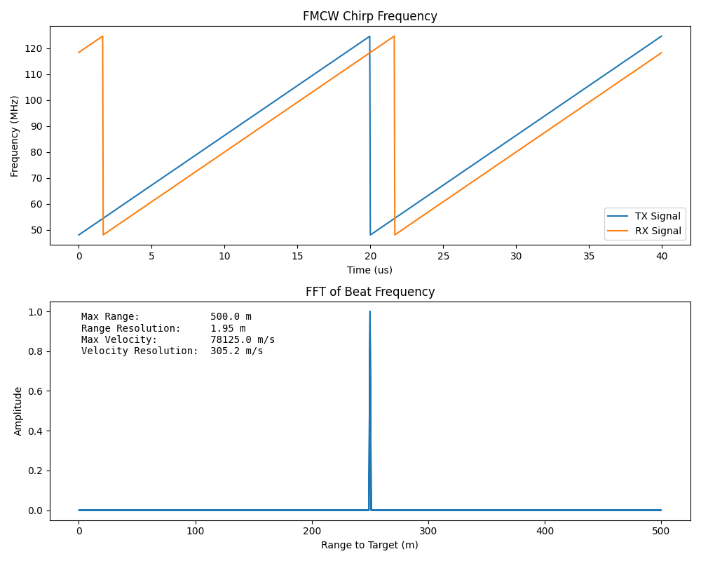

# FMCW Radar Exploration with Python

This repository contains Python examples for exploring the concepts of Frequency-Modulated Continuous-Wave (FMCW) radar. FMCW radar is a radar system that uses frequency modulation to achieve range and velocity estimation of targets. This repository provides code to visualize various aspects of FMCW radar signals and processing.

## Contents

- [Introduction](#introduction)
- [Setup](#setup)
- [Examples](#examples)
- [License](#license)

## Introduction

Frequency-Modulated Continuous-Wave (FMCW) radar is a radar technology that utilizes frequency modulation to measure distances and velocities of targets. This repository aims to provide Python code examples for understanding and visualizing the principles behind FMCW radar.

## Usage

The provided Python scripts demonstrate various aspects of FMCW radar signal processing. These scripts can be run using a Python interpreter or a Jupyter Notebook. The code includes examples of:

- Generating FMCW signals
- Calculating range and velocity
- Visualizing frequency sweeps, range-Doppler maps, and more.

## Examples

- **Frequency Sweep** Visualization: Explore how the transmitted and received signals change over time in an FMCW system.

- **Range-Doppler Map**: Generate and visualize a range-Doppler map, which provides a two-dimensional representation of targets' range and velocity.

- **Signal Processing**: Examine the steps involved in processing FMCW radar signals, including range calculation and Doppler frequency shifts.

## License

This project is licensed under the [MIT License](https://github.com/git/git-scm.com/blob/main/MIT-LICENSE.txt).
