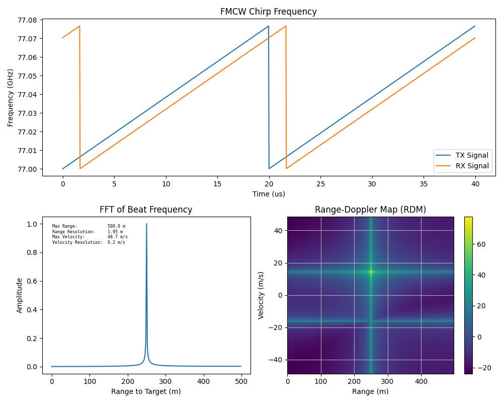

# FMCW Radar Exploration with Python

This repository contains Python examples for exploring the concepts of Frequency-Modulated Continuous-Wave (FMCW) radar. FMCW radar is a radar system that uses frequency modulation to achieve range and velocity estimation of targets. This repository provides code to visualize various aspects of FMCW radar signals and processing.

## Contents

- [Introduction](#introduction)
- [Usage](#usage)
- [Equations](#equations)
- [Constructing a Range-Doppler Map (RDM)](#constructing-a-range-doppler-2d-map)
- [References](#references)

## Introduction

Frequency-Modulated Continuous-Wave (FMCW) radar is a radar technology that utilizes frequency modulation to measure distances and velocities of targets. This repository aims to provide Python code examples for understanding and visualizing the principles behind FMCW radar.



## Usage

The provided Python scripts demonstrate various aspects of FMCW radar signal processing. These scripts can be run using a Python interpreter or a Jupyter Notebook. The code includes examples of:

- Generating FMCW signals
- Calculating range and velocity
- Visualizing frequency sweeps, range-Doppler maps, and more.

## Equations

The modulated intermediate frequency (beat) signal is produced by mixing the transmitted LO with the received reflected signal. A low-pass filter (LPF) is applied to the modulation to reject the high-frequency components leaving behind the slower beat frequency proportional to the round-trip delay of the target.


Assuming a sequence of $N$ chirps and an object moving at a constant velocity, the round-trip time delay at the start of each chirp is incremented linearly. Over the span of a measurement, velocity introduces an accumulating range offset; compensated for by the inclusion range correction term in the radar signal. This range correction can be ignored in fast FMCW measurements where the doppler shift on a single chirp is very small and the number of chirps in a measurement is not too large.

$$
y(t) = \frac{\alpha}{2}\cos\left(\phi_0 - \underbrace{2\pi\frac{2v}{c}f_cnT_c}_{\text{doppler phase}} - 2\pi\left[\underbrace{\frac{2v}{c}(f_c + nB)}_{\text{range correction}} + \underbrace{\frac{B}{T_c}t_d}_{\text{beat}}\right]t\right)
$$

Rearranging the equation reveals the constituent beat and doppler shift phase components contributing to the Beat signal. When the target velocity is zero, only the beat frequency component remains. The constant phase term $ϕ_0$ is set to zero since FMCW systems are not sensitive to initial phase and is considered an arbitrary calibration parameter. In relative measurements, setting the initial phase to zero is a reasonable assumption.

$$
y(t) = \frac{\alpha}{2}\cos\left(\phi_0 - \underbrace{2\pi\frac{B}{T_c}t_d}_{\text{beat}} - \underbrace{2\pi\frac{2v}{c}(f_cnT_c-2\pi(f_c+nB)t)}_{\text{doppler induced}}\right)
$$

| Label                  | LaTeX Equation                          |
| ---------------------- | --------------------------------------- |
| Time Delay (t_d)       | $$ t_d = \frac{2r}{c} $$                |
| Bandwidth of Chirp (B) | $$ B = m_sT_c $$                        |
| Chirp Period           | $$ T*{chirp} = 5.5\frac{2R*{max}}{c} $$ |

Further rearrangement of terms reveals the specific beat and doppler-induced phase components:

$$
\fbox{$y(t) = \frac{\alpha}{2}\cos\left(2\pi\frac{2r}{c}m_st - 2\pi\frac{2v}{c}\left[f_ct+nT_c(f_c+m_st)\right]\right)$}
$$

```math
y(t) = \frac{\alpha}{2}\cos\left(2\pi f_{\text{beat}}t - 2\pi f_{\text{doppler}}(t)\right)
```

### Optimization

The key considerations in designing Frequency-Modulated Continuous-Wave (FMCW) radar systems revolve around optimizing range resolution and velocity detection while navigating trade-offs imposed by system parameters. Wider RF sweep bandwidths lead to improved range resolution, allowing better discrimination between closely spaced targets. Simultaneously, smaller chirp durations enable the radar to detect higher velocities by accommodating more frequency changes within a given time frame.


However, these advantages come with trade-offs. Accommodating wider RF sweep bandwidths and smaller chirp durations necessitates faster ramp slopes, which impact signal processing complexity and power consumption. Additionally, achieving a faster ramp slope for a given maximum detection distance requires a wider Intermediate Frequency (IF) bandwidth. While this accommodates the broader frequency range, it introduces challenges in maintaining sensitivity and receiver complexity.

Ultimately, FMCW radar design requires careful optimization tailored to the specific application. Striking the right balance among RF sweep bandwidth, chirp duration, ramp slope, and IF bandwidth is essential to achieve optimal performance without compromising the system's feasibility and accuracy. By understanding these relationships and trade-offs, radar engineers can make informed decisions to design FMCW radar systems that meet their application's requirements effectively.

## Constructing a Range Doppler 2D Map

A Range-Doppler Map (RDM) is a two-dimensional representation combining information about both the range (distance) and Doppler frequency shift of targets detected by the radar. This map is valuable for extracting information about the location and velocity of targets within the radar's field of view.

A single chirp is insufficient for extracting Doppler information because of ambiguity in relative velocity. This is because a single chirp provides only a limited frequency snapshot of the target's Doppler shift at a particular moment. Multiple chirps are used to distinguish velocity across multiple targets. Consequently, multiple chirps comprise any given measurement.

To obtain the RDM, a two-dimensional Fast Fourier Transform (2D FFT) is performed on the collected data from an FMCW radar system. First an FFT is applied along the rows (fast time axis) to reveal frequency spectra for each chirp, aiding in range determination, and then along the columns (slow time axis) to consolidate Doppler information across chirps. The resulting RDM visually encapsulates range and Doppler shifts, enabling accurate target detection, tracking, and environment analysis for the radar system.

### Slow vs Fast Time

| Dimension | Description                                                                                                                                                                                                                  | Sample Period |
| --------- | ---------------------------------------------------------------------------------------------------------------------------------------------------------------------------------------------------------------------------- | ------------- |
| Fast Time | Determined by ADC and is responsible for sampling the pulse return. It has the faster of the two sample rates and is represented by the symbol 𝑓𝑠. This dimension defines the range information in Radar Data Mapping (RDM). | Sample rate   |
| Slow Time | Based on the number of pulses collected. The optimal rate for collecting these pulses is at the Pulse Repetition Interval (PRI), and the sample rate along this dimension is denoted as 𝑃𝑅𝐹.                                 | Chirp Period  |


## References

### Papers and Slides:

[K. Ramasubramanian, "mmWave Radar for Automotive and Industrial Applications," Texas Instruments, Dec 2017.](https://www.ti.com/content/dam/videos/external-videos/2/3816841626001/5675916489001.mp4/subassets/Mmwave_webinar_Dec2017.pdf)

[K. Ramasubramanian, "Using a complex-baseband architecture in FMCW radar systems," Texas Instruments, SPYY007, May 2017.](http://www.ti.com/lit/spyy007)

[C. Kärnfelt, A. Péden, A. Bazzi, G. El Haj Shhadé, M. Abbas, and T. Chonavel, "77 GHz ACC radar simulation platform," in 2009 9th International Conference on Intelligent Transport Systems Telecommunications (ITST), Lille, France, 2009, pp. 209-214. DOI: 10.1109/ITST.2009.5399354.](https://ieeexplore.ieee.org/document/5399354)

[J.C. Ke, J.Y. Dai, J.W. Zhang, Z. Chen, M.Z. Chen, Y. Lu, L. Zhang, L. Wang, Q.Y. Zhou, L. Li, J.S. Ding, Q. Cheng, and T.J. Cui, "Frequency-modulated continuous waves controlled by space-time-coding metasurface with nonlinearly periodic phases," Light Sci Appl, vol. 11, no. 1, p. 273, Sep 14, 2022. DOI: 10.1038/s41377-022-00973-8. PMID: 36104318; PMCID: PMC9474547.](https://www.ncbi.nlm.nih.gov/pmc/articles/PMC9474547/)

### Stack Exchange References:

Generating IF signal for FMCW radar. [Online]. Available: https://dsp.stackexchange.com/q/68234.
FMCW radar sampling requirements. [Online]. Available: https://dsp.stackexchange.com/a/30986.

### GitHub Source:

kopytjuk, "python-fmcw/RADAR.ipynb," GitHub. [Online]. Available: https://github.com/kopytjuk/python-fmcw/blob/master/RADAR.ipynb.

### Matlab References:

"Automotive Adaptive Cruise Control Using FMCW Technology," MathWorks. [Online]. Available: https://www.mathworks.com/help/radar/ug/automotive-adaptive-cruise-control-using-fmcw-technology.html;jsessionid=fb2d74dedaca45d14cc90204f85b.

Infineon Reference: 7. "FMCW radar working principle simulation based on python — Chapter 1: Distance simulation," Infineon Community. [Online]. Available: https://community.infineon.com/t5/Knowledge-Base-Articles/FMCW-radar-working-principle-simulation-based-on-python-Chapter-1-Distance/ta-p/366803.
